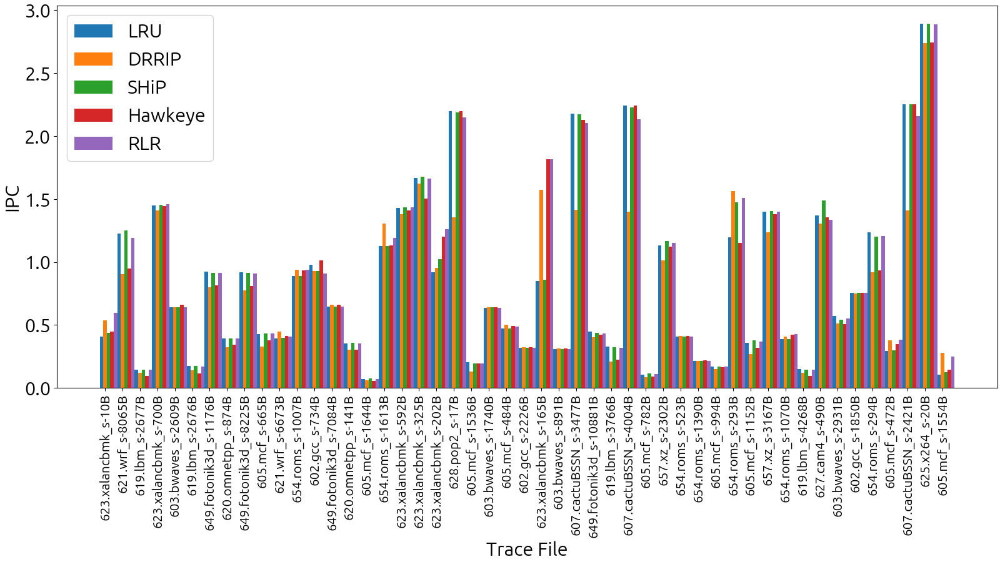
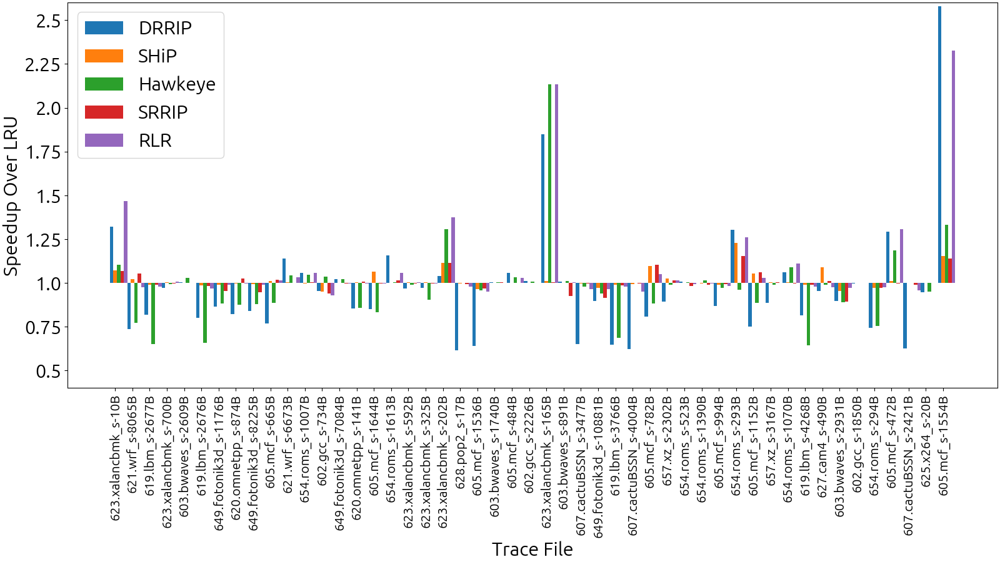
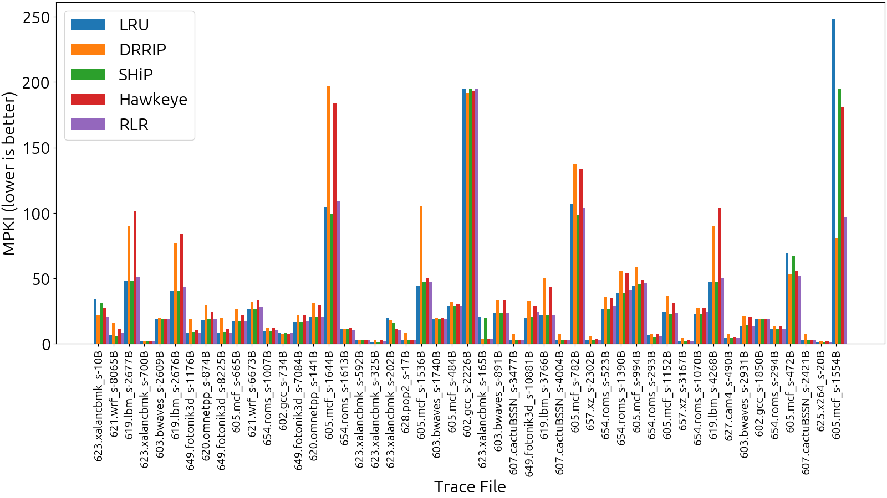

# CS 683 Course Project

### <Project-Title>

### ArchDPT

|   **Member Name**   | **Member Roll No.** |
| :-----------------: | :-----------------: |
| Tirthankar Mazumder |      20B090012      |
| Param Rathour       |      190070049      |
| Divyansh Tiwari     |      200020049      |

---

### Information

#### Repository structure

In the top level directory, we have the ChampSim trace-based simulator as a Git submodule, and a `papers` directory which stores the reference papers (Hawkeye (ISCA 2016) and Mockingjay (ISCA 2022)) that we used, along with the paper we actually implemented, called `reference.pdf`.

```html
Champsim/
├─ download_traces.py
papers/
├─ rlr.pdf
├─ micro-armed-bandit.pdf
├─ methodology-references/
│  ├─ mockingjay.pdf
│  ├─ hawkeye.pdf
logs/
├─ common.py
├─ drrip/
├─ generate-drrip-data.py
├─ lru/
├─ generate-lru-data.py
├─ rlr/
├─ generate-rlr-data.py
├─ ship/
├─ generate-ship-data.py
├─ srrip/
├─ generate-srrip-data.py
├─ ship/
├─ generate-ship-data.py
├─ micro-armed-bandit/
├─ generate-mab-data.py
images/
├─ ipc-plot.png
├─ ipc-speedup-plot.png
├─ mpki-comparison-plot.png
├─ mpki-plot.png
├─ max-min.png
plots/
├─ ipc-plots.py
├─ ipc-speedups-plot.py
├─ mpki-comparison-plot.py
├─ mpki-plot.py
scripts/
├─ run_champsim.sh
├─ build_champsim.sh
├─ process.sh
├─ overall-ipc-speedup.py
├─ analysis.py
bandit/
├─ multi_armed_bandit.hpp
├─ policy.hpp
├─ util. hpp
replacement-policy/
├─ constants.hpp
├─ replacement_policy.hpp
├─ drrip.hpp
├─ lru.hpp
├─ ship.hpp
├─ srrip.hpp
├─ rlr.hpp
micro-armed-bandit/
├─ orchestrator.hpp
├─ orchestrator.cc

```

## Reinforcement Learned Replacement (RLR)
	
### Proposal or Idea

We aim to implement a cost-effective cache replacement policy using Reinforcement Learning (RL). In comparison to the state-of-the-art policies, the suggested method has a low hardware overhead and no modification of control and data path is required to propagate new information. ML, specifically Neural Networks in general are not cost-effective due to the amount of power and area overhead. To account for this, the Reinforcement Learned Replacement (RLR) policy provided in [Designing a Cost-Effective Cache Replacement Policy using Machine Learning (HPCA 2021)](/papers/reference.pdf) uses insights from a pre-trained Neural Network while formulating a RL-based policy. 

<br/>

---

### Steps to run the experiments

First, configure the ChampSim simulator by updating the configuration file properly and running `build_champsim.sh`. Then run the script `download_traces.py` which downloads the memory intensive SPEC 2017 traces to run in the ChampSim simulator. Then run the script `python scripts/logs/generate-rlr-data.py`

<br/>

---

### Plots
#### IPC


#### MPKI



### Conclusion

We observed significant improvement of 8% in IPC of RLR over LRU.

For most traces, RLR has lesser or comparable MPKI.

## Micro-Armed Bandits-based Replacement
	
### Proposal or Idea

Our idea is to implement MAB, which controls which cache replacement policy to use in any given workload at runtime. For evaluation, we consider the following 4 policies: LRU, SHIP, SRRIP, and DRRIP in our action space.

Along the same lines as the [Micro-Armed Bandit: Lightweight & Reusable Reinforcement Learning for Microarchitecture Decision-Making](/papers/micro-armed-bandit.pdf), we implement the Discounted Upper Confidence Bound(DUCB) algorithm for the micro-arm bandit. We need to train the c and $\gamma$ parameters, the method for which we describe in the evaluation section. $c$ is an algorithm hyper-parameter, which is like an exploration constant. It controls the degree of exploration. $\gamma$ acts as a forgetting factor. The reward for the bandit is the average IPC during that RL episode. We normalize the rewards so as to remove the effect of the magnitude of IPC.


<br/>

---

### Steps to run the experiments

First, configure the ChampSim simulator by updating the configuration file properly and running `build_champsim.sh`. Then run the script `download_traces.py` which downloads the memory intensive SPEC 2017 traces to run in the ChampSim simulator. Then run the script `python scripts/logs/generate-mab-data.py`

<br/>

---

### Plots
#### IPC


#### MPKI


### Conclusion

We observed significant improvement of % in IPC of MAB-based policy over LRU.

For most traces, the MAB-based policy has lesser or comparable MPKI.