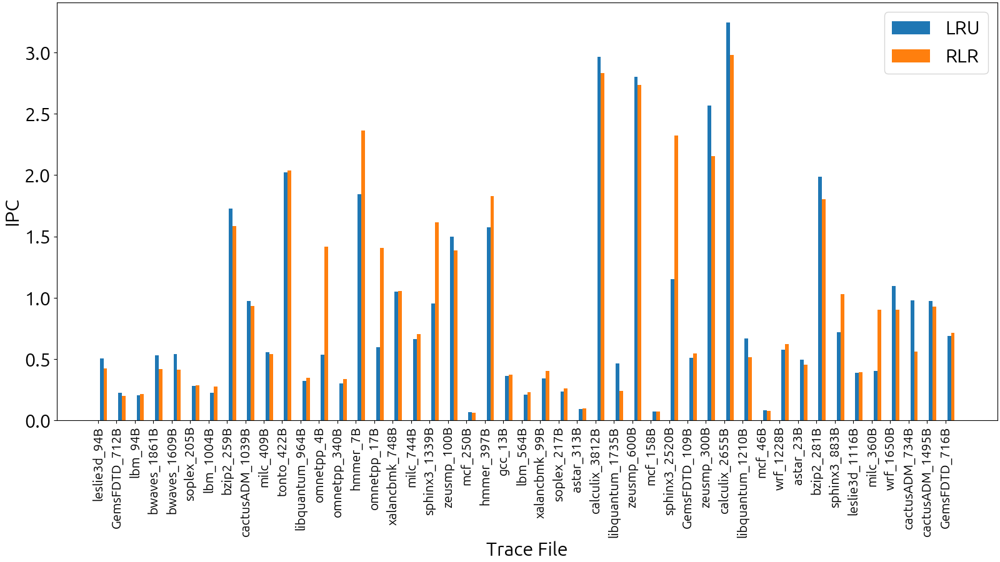
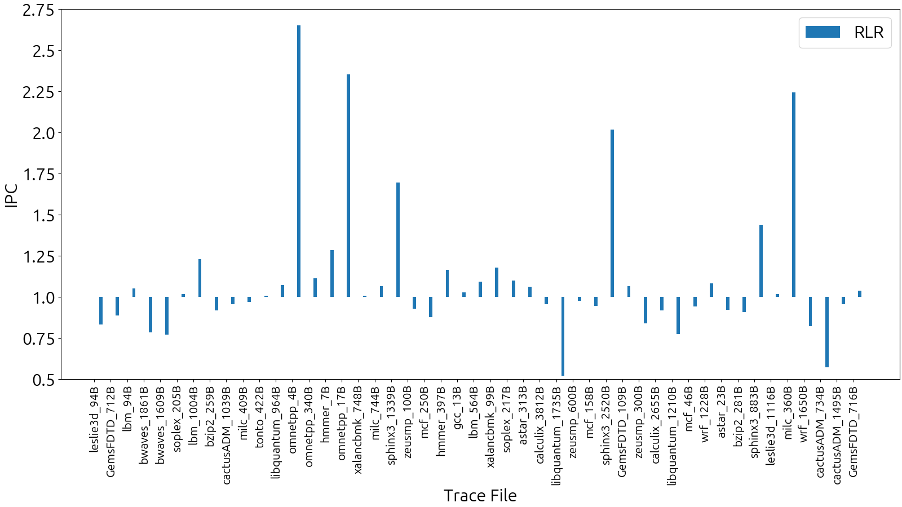
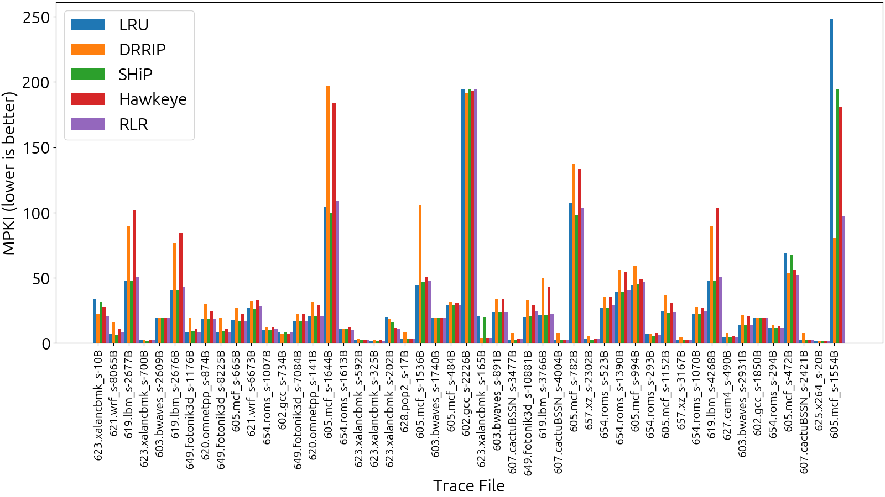
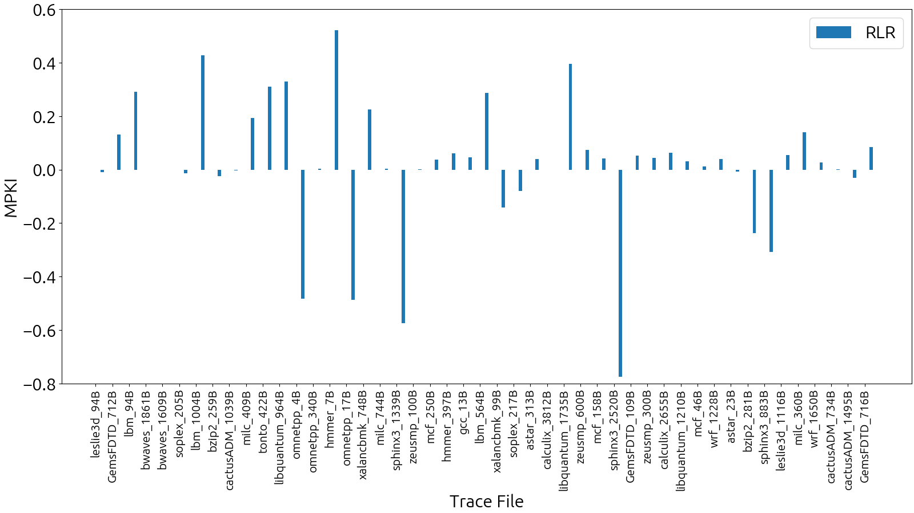

# CS 683 Course Project

### <Project-Title>

### ArchDPT

|   **Member Name**   | **Member Roll No.** |
| :-----------------: | :-----------------: |
| Tirthankar Mazumder |      20B090012      |
| Param Rathour       |      190070049      |
| Divyansh Tiwari     |      200020049      |

---

### Proposal or Idea

We aim to implement a cost-effective cache replacement policy using Reinforcement Learning (RL). In comparison to the state-of-the-art policies, the suggested method has a low hardware overhead and no modification of control and data path is required to propagate new information. ML, specifically Neural Networks in general are not cost-effective due to the amount of power and area overhead. To account for this, the Reinforcement Learned Replacement (RLR) policy provided in [Designing a Cost-Effective Cache Replacement Policy using Machine Learning (HPCA 2021)](/papers/reference.pdf) uses insights from a pre-trained Neural Network while formulating a RL-based policy. 

<br/>

---

### Information

#### Repository structure

In the top level directory, we have the ChampSim trace-based simulator as a Git submodule, and a `papers` directory which stores the reference papers (Hawkeye (ISCA 2016) and Mockingjay (ISCA 2022)) that we used, along with the paper we actually implemented, called `reference.pdf`.

```html
Champsim/
papers/
├─ reference.pdf
├─ methodology-references/
│  ├─ mockingjay.pdf
│  ├─ hawkeye.pdf
logs/
├─ common.py
├─ drrip/
├─ generate-drrip-data.py
├─ lru/
├─ generate-lru-data.py
├─ rlr/
├─ generate-rlr-data.py
├─ ship/
├─ generate-ship-data.py
images/
├─ ipc-plots.png
├─ ipc-speedups.png
├─ mpki-comparison-plot.png
├─ mpki-plot.png
plots/
├─ ipc-plots.py
├─ ipc-speedups.py
├─ mpki-comparison-plot.py
├─ mpki-plot.py
scripts/
├─ run_champsim.sh
├─ build_champsim.sh
├─ process.sh
├─ overall-ipc-speedup.py
├─ analysis.py
```


### Steps to run the experiments


<br/>

---

### Plots
#### IPC


#### MPKI



### Conclusion

We observed significant improvement of 8% in IPC of RLR over LRU.

For most traces, RLR has lesser or comparable MPKI.

<br/>

---
